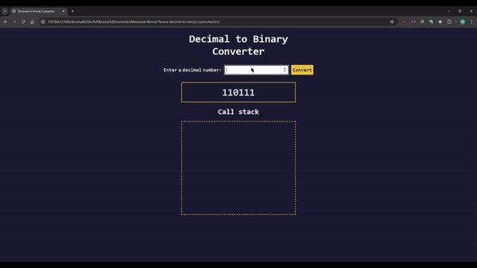

# Decimal to Binary Converter

## Overview

This project is a web-based **Decimal to Binary Converter** that transforms decimal numbers into their binary equivalents. The application demonstrates the recursive approach used in the conversion process through a call stack animation. It is built with HTML, CSS, and JavaScript, ensuring a responsive and interactive experience.

## Features

- Accepts user input for decimal numbers and converts them into binary format.
- Animates the recursive function call stack to explain the conversion process step-by-step.
- Provides real-time validation for user input.
- Responsive design for compatibility with various devices.

## Technologies Used

- **HTML**: Structuring the webpage.
- **CSS**: Styling the interface and ensuring responsiveness.
- **JavaScript**: Handling the conversion logic, user interactions, and animations.

### JavaScript

The `script.js` file includes:
- A recursive function `decimalToBinary(input)` that converts a decimal number to binary.
- Functions to validate and process user input.
- Animation logic to visualize the recursive call stack for the number 5, showing how the binary result is derived step-by-step.
- Event listeners for button clicks and keyboard input to trigger the conversion process.

## Usage

1. Clone the repository or download the files.
2. Open `index.html` in a browser.
3. Use the interface:
   - **Enter a Decimal Number**: Type a non-negative decimal number in the input field.
   - **Convert**: Click the "Convert" button or press `Enter` to see the binary equivalent.
   - For **Input of 5**, a call stack animation will demonstrate the recursive logic.

## Screenshot of the page

Below is an example of the Decimal to Binary Converter in action:

